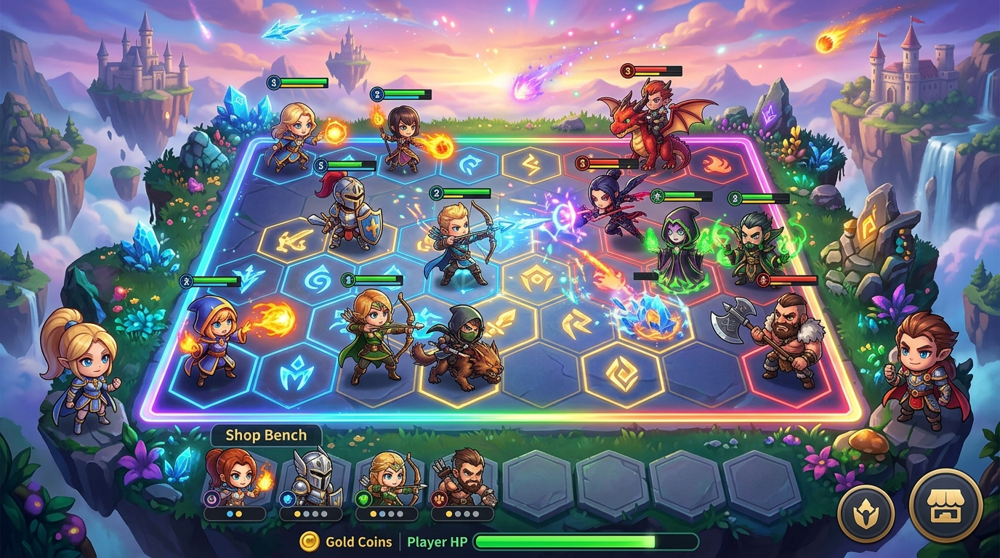

# ♟️ MAGIC CHESS GOGO — Auto Chess Battle Strategy Game

**Nama Pengembang / Author:** **Briant Sinaga (SUD)**  
**Versi:** 1.0.0 (GoGo Edition)  
**Teknologi:** Vanilla HTML5, Modern CSS3, JavaScript (ES6+), Web Audio API, LocalStorage  
**Demo Online / Playable:** [Mainkan Magic Chess GoGo](https://briantgeofanny-crypto.github.io/KFC/MCGG/)

---

## 📸 Cuplikan Permainan (In-Game Gameplay Preview)



---

## 📖 Deskripsi Project

**MAGIC CHESS GOGO** adalah permainan strategi *auto-chess / auto-battler* taktis berbasis web modern yang terinspirasi oleh mekanisme pertempuran catur otomatis papan atas. Pemain berperan sebagai seorang Komandan (*Commander*) yang menyusun formasi pahlawan di papan catur heksagonal, mengelola ekonomi emas secara cerdas, mengaktifkan sinergi fraksi dan peran pahlawan (*Class & Synergy*), meningkatkan tingkatan bintang pahlawan (*Star-up 1★, 2★, 3★*), dan menggunakan kartu sakti **GoGoCard** untuk mengeliminasi seluruh lawan hingga menjadi komandan terakhir yang bertahan di arena!

---

## 🎯 Tujuan Project

1. **Melatih Kemampuan Analisis Strategi & Adaptasi**: Mendorong pemain untuk berpikir cepat dalam memilih hero di Shop, membaca sinergi terbaik, dan merespons taktik lawan di papan heksagonal.
2. **Manajemen Risiko & Ekonomi (*Resource Management*)**: Mengasah disiplin pemain dalam memanfaatkan sistem *Interest Gold*, *Winning/Losing Streak*, dan waktu optimal untuk menaikkan level kapasitas komandan.
3. **Penyajian Pengalaman Gaming Premium Tanpa Instalasi**: Menyediakan game strategi kelas AAA yang ringan, responsif, berkecepatan 60 FPS di PC maupun smartphone, langsung berjalan melalui browser tanpa plugin tambahan.
4. **Demonstrasi Arsitektur Web Game Mandiri**: Membuktikan kekuatan arsitektur modular Vanilla JavaScript dalam menangani state machine kompleks: simulasi AI musuh, pathfinding grid heksagonal, kalkulasi sinergi dinamis, dan efek pertarungan real-time.

---

## 🌟 Fitur-Fitur Unggulan Permainan

### 1. 👑 8 Komandan Unik dengan Skill Spesial
Setiap komandan memiliki karakteristik dan kemampuan pasif/aktif yang mengubah jalannya pertempuran:
- **Abe**: Spesialis serangan agresif dan bonus damage burst.
- **Eva**: Penguat sinergi dan buff regenerasi seluruh hero di papan.
- **Yuki**: Pengorbanan hero cadangan untuk melepaskan ledakan energi raksasa.
- **Buss**: Ahli rekayasa ekonomi dan diskon perputaran hero di toko.
- **Ragnar**: Pertahanan kokoh dan pemulihan HP komandan saat krisis.
- **Remy**: Kemampuan penggandaan emas dan pengelolaan bunga modal.
- **Dubi**: Pemasang jebakan proyektil mematikan di barisan musuh.
- **Connie**: Pemanggil hero acak langsung ke papan pertarungan.

### 2. ⚔️ 57 Hero Terbagi dalam Ragam Kelas & Sinergi
- **Tingkatan Bintang (Star Level)**: Kumpulkan 3 hero bintang 1 yang sama untuk bertransformasi menjadi **2★**, dan 3 hero bintang 2 untuk mencapai puncak kekuatan **3★** dengan statistik HP, Attack, dan Skill yang berlipat ganda.
- **Matriks Sinergi Kompleks**:
  - *Class*: Weapon Master, Mage, Marksman, Assassin, Guardian, Support, Wrestler.
  - *Faction*: Cadia Riverlands, Moniyan Empire, Abyss, Northern Vale, Elf, Cyborg, Western Expanse.
- Aktifkan efek threshold sinergi (misal: 3/6 Mage, 2/4/6 Weapon Master) untuk memperoleh lifesteal, perisai, stun, atau ledakan sihir!

### 3. 🃏 Kartu Sakti "GoGoCards"
Pilihan kartu taktis unik yang diberikan secara berkala pada ronde krusial untuk memberikan keunggulan instan:
- Emas dadakan (*Sudden Wealth*)
- Salinan hero instan (*Doppelganger Mirror*)
- Peningkatan batas populasi hero (*Tactical Expansion*)
- Buff damage ekstrem seluruh tim (*War Cry*)

### 4. 💰 Mekanisme Ekonomi Otentik
- **Base Income**: Emas rutin setiap awal ronde.
- **Interest Income**: Bonus +1 emas untuk setiap kelipatan 10 emas yang disimpan (hingga maksimal +5 bunga).
- **Streak Bonus**: Hadiah tambahan untuk kemenangan beruntun (*Win Streak*) maupun kekalahan taktis terencana (*Lose Streak*).
- **Bench & Shop**: Toko hero berputar dengan alokasi 5 kartu per refresh, bench 8 slot hero cadangan, dan tombol level up.

### 5. 🤖 AI Bot Lawan Cerdas & Pathfinding Heksagonal
- Bot lawan menyusun sinergi mereka sendiri secara otomatis, memilih hero terbaik, dan bertarung menggunakan logika taktik dinamis.
- Pergerakan hero di papan heksagonal dengan deteksi jangkauan serang (*melee / ranged*), penargetan otomatis musuh terdekat, dan pelepasan ultimate skill saat mana bar terisi penuh!

---

## 🕹️ Panduan Cara Bermain

1. **Persiapan di Lobby (`index.html`)**:
   - Pilih Komandan favoritmu.
   - Pelajari ensiklopedia hero, sinergi, dan kartu GoGo.
   - Klik **"Start Match"** untuk memasuki arena pertempuran (`game.html`).
2. **Fase Belanja & Penempatan (Preparation Phase)**:
   - Beli hero dari Shop di bagian bawah.
   - Seret atau tempatkan hero dari Bench ke petak heksagonal papan catur milikmu.
   - Perhatikan indikator sinergi yang aktif di panel kiri.
3. **Fase Pertempuran Otomatis (Combat Phase)**:
   - Hero milikmu dan hero lawan akan otomatis bertarung, saling serang, mengisi mana, dan melancarkan jurus pamungkas.
   - Jika kamu menang, komandan lawan akan kehilangan HP. Jika kalah, HP komandanmu berkurang berdasarkan jumlah hero musuh yang tersisa.
4. **Kemenangan Puncak**:
   - Terus tingkatkan formasi hero hingga level 3★ dan kalahkan seluruh komandan lawan untuk menjadi **Champion of Magic Chess GoGo**!

---

## 📁 Struktur Berkas Proyek

```
MCGG/
├── index.html              # Layar Lobby Utama, Pemilihan Komandan & Ensiklopedia
├── game.html               # Arena Pertarungan Papan Heksagonal & HUD Taktis
├── screenshot_preview.jpg  # Gambar preview tampilan gameplay resolusi tinggi
├── README.md               # Dokumentasi lengkap proyek
├── css/
│   ├── main.css            # Desain warna tema, font, dan utilitas global
│   ├── lobby.css           # Tata letak menu, pemilihan hero & komandan
│   ├── game.css            # Gaya papan heksagonal, shop, bench, dan unit bar
│   └── animations.css      # Animasi serang, pelepasan sihir, dan vfx heksagon
└── js/
    ├── main.js             # Entry point & controller lobby
    ├── game.js             # State machine pengatur ronde & waktu
    ├── board.js            # Logika koordinat petak heksagonal & posisi hero
    ├── hero.js             # Class entitas hero, statistik, dan bar HP/Mana
    ├── commander.js        # Data & skill spesial 8 komandan
    ├── shop.js             # Logika toko roll kartu hero & peluang rarity
    ├── economy.js          # Perhitungan emas, bunga interest, dan streak
    ├── synergy.js          # Pendeteksi dan kalkulator buff sinergi
    ├── battle.js           # Mesin kalkulasi pertarungan real-time
    ├── ai.js               # Kecerdasan buatan lawan
    ├── gogocard.js         # Sistem pemilihan kartu taktis GoGoCards
    └── data/
        ├── heroes.js       # Database 57 hero, skill, dan statistik
        ├── commanders.js   # Database komandan dan deskripsi skill
        ├── synergies.js    # Database sinergi Class & Faction
        ├── cards.js        # Database kartu GoGoCards
        └── items.items.js  # Database item pelengkap
```

---

## 🌐 Cara Menjalankan Secara Online (GitHub Pages)

Proyek ini telah siap dimainkan langsung dari repository GitHub via GitHub Pages:
- **URL Pertempuran**: `https://briantgeofanny-crypto.github.io/KFC/MCGG/`

---

*Dikembangkan dengan penuh dedikasi oleh **Briant Sinaga (SUD)**.*