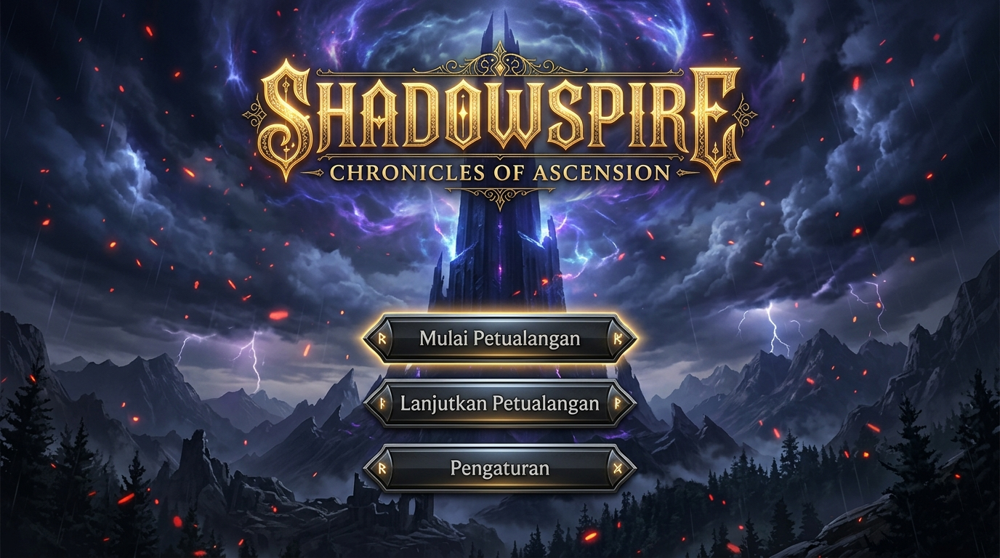

# 🗡️ SHADOWSPIRE: CHRONICLES OF ASCENSION

> **Dark Fantasy Roguelike Deckbuilder Card Game** — Dibangun secara murni dengan arsitektur web modern (**Vanilla HTML5, Vanilla CSS3, dan Vanilla JavaScript ES6+**), dilengkapi kapabilitas **Progressive Web App (PWA)**, sistem audio prosedural, dan mekanisme pertarungan taktis mendalam.




---

## 📜 Sinopsis & Latar Belakang

*Menara Kegelapan (The Spire) telah bangkit kembali, membelah langit dan memancarkan radiasi energi anomali yang merusak tatanan realitas. Para monster legendaris dari kehampaan kosmis bermunculan, menjaga setiap lantai menara yang terus bermutasi.*

Sebagai salah satu dari Pahlawan Terpilih yang masih bertahan, Anda harus memanjat lantai demi lantai Menara Kematian, menyusun kombinasi kartu tempur (*deckbuilding*), merebut relik keramat kuno, meramu ramuan alkimia, dan mengalahkan para Penjaga Menara sebelum kehancuran abadi menelan dunia.

---

## ⚔️ Fitur Utama Permainan

### 1. 🎴 Sistem Pertarungan Kartu Taktis (*Turn-Based Combat*)
- **Manajemen Energi & Tangan**: Setiap giliran dimulai dengan alokasi energi tetap untuk memainkan kombinasi kartu Serangan (*Attack*), Keterampilan Bertahan (*Skill/Block*), dan Kekuatan Pasif Berkelanjutan (*Power*).
- **Mekanisme Intent Musuh**: Setiap aksi monster (menyerang, memperkuat diri, memberikan debuff, atau bertahan) ditelegrafkan secara transparan di atas kepala musuh, menuntut perhitungan strategi matang setiap ronde.
- **Efek Status & Debuff Kompleks**: *Vulnerable, Weak, Frail, Strength, Dexterity, Poison, Metallicize, Barricade*, dan puluhan sinergi status lainnya.
- **Draw, Discard, & Exhaust Pile**: Kartu tertentu memiliki sifat *Exhaust* yang akan dibakar dari pertempuran saat dimainkan untuk efek dahsyat.

### 2. 🗺️ Peta Menara Prosedural (*Interactive Spire Map*)
Peta jalur pendakian lantai bercabang dengan keputusan strategis di setiap langkah:
- **Pertarungan Monster Biasa**: Mengumpulkan emas, kartu baru, dan ramuan.
- **Monster Elite**: Ujian berat dengan imbalan Relik Legendaris dan emas berlimpah.
- **Pedagang / Toko Kelana (*Merchant*)**: Membeli kartu langka, menghapus kartu beban (*card removal*), membeli relik dan ramuan.
- **Perkemahan (*Rest Site*)**: Memilih antara memulihkan Health Points (*Rest*) atau meningkatkan level kartu secara permanen (*Smith / Upgrade*).
- **Kejadian Misterius (*Events*)**: Percabangan naratif dengan pilihan moral dan taruhan risiko tinggi.
- **Boss Lantai (*Act Boss*)**: Pertarungan epik multi-fase penentu nasib pendakian.

### 3. 🛡️ Pahlawan Unik & Arketipe Gaya Bermain
Setiap pahlawan memiliki kartu awal, relik bawaan, dan sinergi unik:
- **The Ironclad (Prajurit Pasukan Besi)**:
  - *Sinergi*: Peningkatan *Strength* brutal, mekanisme pembakaran kartu (*Exhaust synergy*), *Barricade armor stacking*, dan *Reaper lifesteal*.
  - *Relik Awal*: **Burning Blood** (memulihkan HP di setiap akhir pertarungan).
- **The Silent (Pemburu Beracun dari Kabut Asap)**:
  - *Sinergi*: Tumpukan racun mematikan (*Deadly Poison scaling*), rentetan pisau tak terbatas (*Infinite Shivs*), dan manipulasi putaran kartu (*Discard draw engine*).
  - *Relik Awal*: **Ring of the Snake** (menarik 2 kartu tambahan di giliran pertama).
- **The Defect (Automaton Kuno Penyalur Energi)**:
  - *Sinergi*: Pemanggilan Orb Elemental (*Lightning, Frost, Dark, Plasma*), aktivasi reaktor *Overclock*, dan pelepasan badai energi (*Evoke mechanics*).
  - *Relik Awal*: **Cracked Core** (memanggil 1 Lightning Orb di awal tempur).
- **The Watcher (Pertapa Meditatif Penjaga Keseimbangan)**:
  - *Sinergi*: Pergantian wujud pertapaan (*Calm stance* untuk regenerasi energi, *Wrath stance* untuk penggandaan damage 200%, dan *Divinity stance*).

### 4. 🏆 Tingkat Kesulitan Bertingkat (*Ascension Modes*)
- **Normal**: Panggilan Menara (Standar petualangan).
- **Ascension I**: Dominasi Elite (Lebih banyak monster elite berbahaya).
- **Ascension II**: Monster Mematikan (Musuh memiliki damage dan HP lebih agresif).
- **Ascension III**: Kelangkaan & Derita (Biaya toko lebih mahal, penyembuhan perkemahan berkurang).
- **Hellfire Ascendant**: Siksaan Neraka Abadi (Tantangan pamungkas tanpa ampun).

### 5. 💎 Koleksi Relik & Ramuan Alkimia
- Puluhan relik unik dengan efek pasif pengubah alur permainan (*game-changing passive modifiers*).
- Berbagai ramuan alkimia tempur: *Fire Potion, Block Potion, Strength Potion, Elixir of Swiftness*, dan ramuan legendaris.

---

## 🛠️ Arsitektur Teknis & Struktur Proyek

Proyek ini dibangun secara mandiri tanpa menggunakan framework berat pihak ketiga:

```
slay_the_spire/
├── index.html              # Antarmuka semantik master, arena pertarungan, HUD, dan modal dialog
├── manifest.json           # Konfigurasi Progressive Web App (PWA installable)
├── sw.js                   # Service Worker untuk caching aset dan dukungan 100% offline play
├── serve_app.py            # Local HTTP server mandiri dengan MIME-type handling optimal
├── START_SPIRE.bat         # Launcher Windows instan 1-klik
├── test_suite.html         # Suite verifikasi dan automated unit test gameplay
├── css/
│   ├── spire-theme.css     # Palet warna dark fantasy, tipografi Cinzel, dan variabel desain
│   ├── spire-cards.css     # Render visual kartu (Rarity border, holo shimmer, cost badge)
│   ├── spire-combat.css    # Layout arena pertempuran, animasi serangan, intent, dan status buff
│   ├── spire-map.css       # Visualisasi graf peta percabangan lantai menara
│   └── spire-modals.css    # Dialog hadiah, toko pedagang, perkemahan, dan event pilihan
├── js/
│   ├── app.js              # Game orchestrator, UI controller, event listeners, dan scene manager
│   ├── gameState.js        # Engine state permainan, deck manager, difficulty calculator
│   ├── combat.js           # Core loop pertarungan giliran, kalkulasi damage, block, dan intent
│   ├── cards.js            # Database kartu lengkap beserta logika efek dan upgrade (+1)
│   ├── enemies.js          # AI perilaku monster, pola serangan, dan boss mechanics
│   ├── relics.js           # Database relik dan trigger pasif pertarungan
│   ├── potions.js          # Sistem ramuan tempur instan
│   ├── events.js           # Engine kejadian naratif acak dan konsekuensi pilihan
│   ├── map.js              # Algoritma generasi graf peta prosedural
│   ├── audio.js            # Web Audio API procedural sound effects & background audio
│   ├── vfx.js              # Efek visual partikel Canvas, screen shake, dan floating damage text
│   ├── i18n.js             # Dukungan lokalisasi bahasa
│   └── pwa.js              # PWA install prompt dan offline sync
└── icons/                  # Aset icon favicon dan splash PWA (192px, 512px, maskable)
```

---

## 🚀 Cara Menjalankan Game

### Metode 1: 1-Klik Launcher Windows (Rekomendasi)
Cukup klik dua kali berkas:
```cmd
START_SPIRE.bat
```
Script akan otomatis mendeteksi lingkungan Python dan menjalankan server lokal berkecepatan tinggi, lalu membuka browser ke permainan secara otomatis.

### Metode 2: Menggunakan Browser Langsung
Anda dapat langsung membuka berkas **`index.html`** di browser modern apa pun (Google Chrome, Microsoft Edge, Mozilla Firefox, Opera, Brave).

### Metode 3: Menjalankan Server Python Manual
```bash
python serve_app.py
```
Akses di browser melalui: `http://localhost:8080`

### Metode 4: Instalasi sebagai Aplikasi Desktop / Mobile (PWA)
Saat game dibuka di Google Chrome atau Microsoft Edge, klik ikon **"Install App"** di bilah alamat browser untuk memasangnya sebagai aplikasi mandiri di komputer atau smartphone Anda.

---

## 🎮 Kontrol Permainan

| Tombol / Aksi | Fungsi |
|---|---|
| **Klik & Drag Kartu** | Memilih dan mengarahkan kartu ke monster atau karakter Anda |
| **Klik Kartu Target** | Memainkan kartu pada sasaran yang dipilih |
| **Tombol Akhiri Giliran** | Mengakhiri ronde pemain dan memicu giliran monster |
| **Ikon Ramuan** | Menggunakan ramuan di saku inventory saat darurat |
| **Klik Node Peta** | Memilih lantai tujuan pada peta menara |
| **Hover Kartu / Relik** | Melihat tooltip penjelasan detail efek dan status |

---

## 👤 Pengembang

- **Nama**: Briant Sinaga (SUD)
- **Akun GitHub**: [@briantgeofanny-crypto](https://github.com/briantgeofanny-crypto)
- **Lisensi**: MIT License — Bebas dimainkan, dikembangkan, dan dipelajari.
